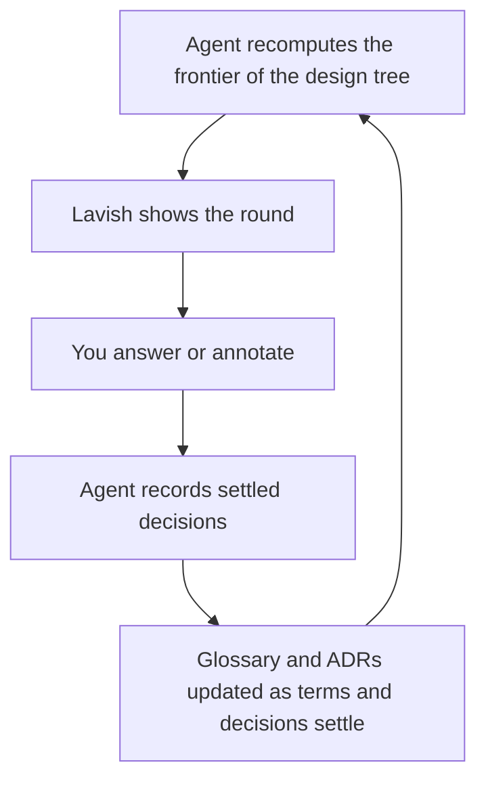

# Grill in Lavish

**Rigorous questions. A readable interface. A plan that improves after every answer.**

An independent Agent Skill that runs [Matt Pocock's grill-with-docs](https://github.com/mattpocock/skills)
through [Lavish AXI](https://github.com/kunchenguid/lavish-axi). The agent decides
what to ask next; Lavish displays each round and sends your answers back.

This is a small integration, not a fork of Lavish or a standalone AI app.

## The loop



One workflow, no modes to pick:

- **Always:** read the project's existing docs, ask the whole frontier through
  Lavish, and generate follow-ups from your answers.
- **When a term settles:** the glossary (`CONTEXT.md`) is updated in that round.
- **When a decision is hard to reverse, surprising without context, and a real
  trade-off:** an ADR is offered or recorded.
- **When you say "discussion only":** project documents stay untouched and
  everything lives in session state, including after a resume.

Visual rounds show concise question cards, recommendations, and a decision map;
answer with options or your own words. State is resumable and saved
independently of the browser, including dependencies and unresolved research.

## How it is built

`grill-lavish` is a thin coordinator: it loads the upstream skills and adds the
Lavish transport. Nothing about questioning or documentation is restated here.

| Skill | Role | Source |
| --- | --- | --- |
| `grilling` | Questioning discipline: design tree, frontier, rounds | Matt Pocock, verbatim copy |
| `domain-modeling` | Glossary (`CONTEXT.md`) and ADR rules and formats | Matt Pocock, verbatim copy |
| `grill-with-docs` | Upstream entrypoint that composes the two above | Matt Pocock, verbatim copy |
| `grill-me` | Upstream entrypoint for grilling alone | Matt Pocock, verbatim copy |
| `lavish` | Renders the page and returns your feedback | Kun Chen, external runtime via `npx -y lavish-axi` |

The copies under `skills/` are unmodified snapshots of
[mattpocock/skills](https://github.com/mattpocock/skills) at the commit listed in
[sources.md](skills/grill-lavish/references/sources.md). `grill-with-docs` and
`grill-me` are user-invoked upstream, so a skill cannot call them; `grill-lavish`
loads `grilling` and `domain-modeling` directly, which is what `grill-with-docs`
does. If Matt's skills are already installed, the agent uses those; the bundled
copies are a fallback and a way to install everything from one repository.

## Install

You need Node.js 20+, an agent that can read Agent Skills and run shell commands,
and a browser that can reach the agent's local Lavish server. No API key is
needed by this integration; model usage remains with your chosen agent.

Install everything from GitHub:

```sh
npx skills add yck2024/grill-lavish --skill '*'
```

Or pick only what you are missing, for example when Matt's skills are already
installed through `claude plugins install mattpocock-skills` or
`npx skills add mattpocock/skills`:

```sh
npx skills add yck2024/grill-lavish --skill grill-lavish
```

Or clone and install from a local checkout:

```sh
git clone https://github.com/yck2024/grill-lavish.git
cd grill-lavish
npx skills add . --skill '*'
```

Choose your agent in the installer's prompts. Add `-g` for a global install.
For a private repository, a local authenticated checkout avoids assuming the
installer can fetch private GitHub content. This project is not published to npm.

Lavish is started on demand through `npx -y lavish-axi`. Respect a project's
installed or pinned Lavish version.

## Use

Ask your agent:

> Grill me in Lavish about this feature. Keep asking follow-up questions until
> the plan is understood.

Or:

> Use grill-lavish to design our support dashboard. Don't implement yet.

Or, to keep project documents untouched:

> Use grill-lavish, discussion only, to think through the migration.

In clients exposing skill slash commands, invoke `/grill-lavish`. Natural
language also works when the agent recognizes installed skill descriptions.
These are prompts to an AI agent, not standalone CLI commands.

Queue answers on the page, then press **Send to Agent** in Lavish. The agent
evaluates the answers, updates state and documents, and renders the next round
at the same file path. Changing a radio option does not send feedback.

## Try the visual example

```sh
npm run demo
npx -y lavish-axi examples/dashboard.html
```

To demonstrate delivery manually in another terminal:

```sh
npx -y lavish-axi poll examples/dashboard.html
```

For a real interview, let the AI agent own that poll and process its result.
A terminal poll alone prints feedback; it does not generate follow-ups. Opening
the HTML directly shows a standalone preview with an explicit unsent payload
fallback. It does not pretend that an agent is connected.

## What lives where

| File | Purpose |
| --- | --- |
| `skills/grill-lavish/SKILL.md` | Coordinator: loads the upstream skills, runs the Lavish loop |
| `skills/grill-lavish/references/state.md` | Session JSON contract (the design tree) |
| `skills/grill-lavish/references/sources.md` | Upstream commits and how to refresh the copies |
| `skills/grill-lavish/scripts/session.mjs` | Dependency validation and HTML rendering |
| `skills/grill-lavish/assets/review.html` | Portable question-page template |
| `skills/grilling/`, `skills/domain-modeling/` | Verbatim upstream skills the coordinator loads |
| `skills/grill-with-docs/`, `skills/grill-me/` | Verbatim upstream entrypoints, for completeness |
| `examples/dashboard.session.json` | Illustrative first round |
| `test/session.test.mjs` | State and rendering behavior checks |

Session files normally live under `.grill-lavish/` and are ignored by Git.
`CONTEXT.md` remains a glossary. ADRs record significant trade-offs. Neither is
used as a dumping ground for the whole interview transcript.

## Development and limits

```sh
npm test
npm run demo
```

The helper and tests have no third-party dependencies. Lavish is an external
runtime. State validation checks dependency consistency; the agent is still
responsible for asking good questions and applying user answers correctly.

Keep one active agent poll per session. Do not detach it unless the harness can
reliably wake the same agent. A stopped or disconnected review is not approval
to build. Browser previews and automated state tests do not establish end-to-end
compatibility with every version of Claude Code, Codex, Pi, or Lavish.

Version 0.2.0 removes the interview/docs mode split (session `schema_version`
is now 2) and delegates questioning and documentation to the upstream skills.
The agent checkpoints feedback, handles stale answers, revises the design tree,
and writes project documentation according to those skills. The renderer does
not perform those reasoning steps itself.

## Credits

Questioning and documentation behavior comes from Matt Pocock's MIT-licensed
skills, redistributed verbatim under `skills/`. Visual feedback uses Kun Chen's
MIT-licensed Lavish AXI. See [THIRD-PARTY-NOTICES.md](THIRD-PARTY-NOTICES.md)
and the skill's [source notes](skills/grill-lavish/references/sources.md) for
reviewed versions. Neither author is affiliated with or endorses this integration.
