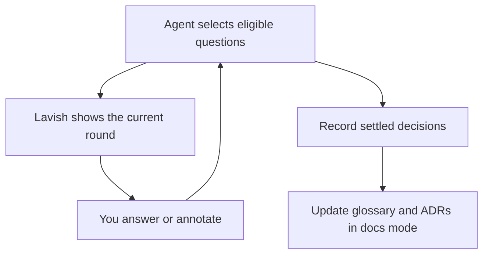

# Grill in Lavish

**Rigorous questions. A readable interface. A plan that improves after every answer.**

An independent Agent Skill combining [Matt Pocock's grilling workflows](https://github.com/mattpocock/skills)
with [Lavish AXI](https://github.com/kunchenguid/lavish-axi). The agent decides
what to ask next; Lavish displays each round and sends your answers back.

This is a small integration, not a fork of Lavish or a standalone AI app.

## The loop



- **Interview mode:** stress-test assumptions, clarify scope, and keep generating
  follow-ups based on your answers.
- **Docs mode:** also sharpen project vocabulary and record meaningful decisions
  while the interview is happening.
- **Visual rounds:** read concise question cards, recommendations, and a decision
  map; answer with options or your own words.
- **Resumable state:** save decisions independently of the browser, including
  dependencies and unresolved research.

## Install

You need Node.js 20+, an agent that can read Agent Skills and run shell commands,
and a browser that can reach the agent's local Lavish server. No API key is
needed by this integration; model usage remains with your chosen agent.

Install directly from GitHub:

```sh
npx skills add yck2024/grill-lavish --skill grill-lavish
```

Or clone and install from a local checkout:

```sh
git clone https://github.com/yck2024/grill-lavish.git
cd grill-lavish
npx skills add . --skill grill-lavish
```

Choose your agent in the installer's prompts. Add `-g` for a global install.
For a private repository, a local authenticated checkout avoids assuming the
installer can fetch private GitHub content. This project is not published to npm.

The bundled skill includes the adapted questioning and documentation rules, so
the original Matt skills are optional. Lavish is started on demand through
`npx -y lavish-axi`. Respect a project's installed or pinned Lavish version.

## Use

Ask your agent:

> Use grill-lavish in interview mode to clarify this feature. Show each round
> in Lavish and keep asking follow-up questions until the plan is understood.

Or:

> Use grill-lavish in docs mode to design our support dashboard. Maintain the
> glossary and record significant decisions as we go. Don't implement yet.

In clients exposing skill slash commands, invoke `/grill-lavish`. Natural
language also works when the agent recognizes installed skill descriptions.
These are prompts to an AI agent, not standalone CLI commands.

Queue answers on the page, then press **Send to Agent** in Lavish. The agent
evaluates the answers, updates state and documents, and renders the next round
at the same file path. Changing a radio option does not send feedback.

## Try the visual example

```sh
npm run demo
npx -y lavish-axi examples/dashboard.html
```

To demonstrate delivery manually in another terminal:

```sh
npx -y lavish-axi poll examples/dashboard.html
```

For a real interview, let the AI agent own that poll and process its result.
A terminal poll alone prints feedback; it does not generate follow-ups. Opening
the HTML directly shows a standalone preview with an explicit unsent payload
fallback. It does not pretend that an agent is connected.

## What lives where

| File | Purpose |
| --- | --- |
| `skills/grill-lavish/SKILL.md` | Agent workflow and review loop |
| `skills/grill-lavish/references/` | Questioning, docs, state, and source rules |
| `skills/grill-lavish/scripts/session.mjs` | Dependency validation and HTML rendering |
| `skills/grill-lavish/assets/review.html` | Portable question-page template |
| `examples/dashboard.session.json` | Illustrative first round |
| `test/session.test.mjs` | State and rendering behavior checks |

Session files normally live under `.grill-lavish/` and are ignored by Git.
`CONTEXT.md` remains a glossary. ADRs record significant trade-offs. Neither is
used as a dumping ground for the whole interview transcript.

## Development and limits

```sh
npm test
npm run demo
```

The helper and tests have no third-party dependencies. Lavish is an external
runtime. State validation checks dependency consistency; the agent is still
responsible for asking good questions and applying user answers correctly.

Keep one active agent poll per session. Do not detach it unless the harness can
reliably wake the same agent. A stopped or disconnected review is not approval
to build. Browser previews and automated state tests do not establish end-to-end
compatibility with every version of Claude Code, Codex, Pi, or Lavish.

Version 0.1.0 is a starting integration, not a full automatic orchestrator:
the agent checkpoints feedback, handles stale answers, revises the decision tree,
and writes project documentation according to the skill instructions. The
renderer does not perform those reasoning steps itself.

## Credits

Questioning and documentation behavior is adapted from Matt Pocock's MIT-licensed
skills. Visual feedback uses Kun Chen's MIT-licensed Lavish AXI. See
[THIRD-PARTY-NOTICES.md](THIRD-PARTY-NOTICES.md) and the skill's
[source notes](skills/grill-lavish/references/sources.md) for reviewed versions.
Neither author is affiliated with or endorses this integration.
